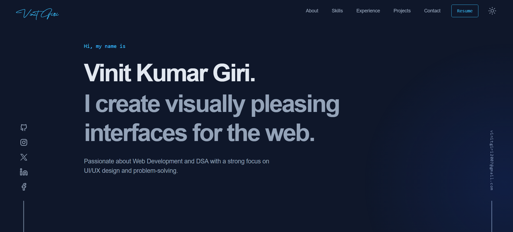

<h1 align="center">vinitgiri.vercel.app</h1>


<p align="center">
  A portfolio website built with 
  <a href="https://nextjs.org/" target="_blank">Next.js</a> 
  and hosted with 
  <a href="https://vercel.com/" target="_blank">Vercel</a>.
</p>

<p align="center">
  
  
</p>

</p>
# vinitgiri.vercel.app

<p align="center">
  
</p>

A portfolio website built with Next.js and hosted with Vercel.

<p align="center">
  <a href="https://choosealicense.com/licenses/mit/">
    
  </a>
  
</p>

<br>

## Table of Contents

- [Sections](#sections)
- [Built With](#built-with)
- [How to use](#how-to-use)
- [Contributing](#contributing)
- [Continuous Development](#continuous-development)
- [Contact](#contact)
- [Acknowledgements](#acknowledgements)
- [Show Your Support](#show-your-support)

## Sections

- Hero
- About
- Skills
- Experience
- Projects
- Contact

## Built With

- [Next.js](https://nextjs.org/)
- [TypeScript](https://www.typescriptlang.org/)
- [TailwindCSS](https://tailwindcss.com/)
- [Framer Motion](https://www.framer.com/motion/) - For animations
- [Iconify](https://icon-sets.iconify.design/) - For icons
- [Lottie Files](https://lottiefiles.com/) - For illustrations

## How to use

###### To clone and run this application, you'll need [Git](https://git-scm.com) and [Node.js (v20.18.0)](https://nodejs.org/en/download/) (which comes with [yarn](https://yarnpkg.com) installed on your computer).

1. Fork this repository and clone the project

###### Please give me proper credit by linking back to [vinit-giris-projects.vercel.app](https://vinit-giris-projects.vercel.app).

```bash
  git clone https://github.com/<YOUR USERNAME>/portfolio-website.git
```

2. Go to the project directory

```bash
  cd portfolio-website
```

3. Install dependencies

```bash
  yarn
```

4. Start the server

```bash
  yarn dev
```

- To change the content, edit `src/lib/content/`

- To change the **resume**, change `/public/resume.pdf` with your resume (name must be `resume.pdf`)

- To change the **About Section**, edit `src/containers/About.tsx`

- To change the theme, edit `src/styles/globals.css`

## Contributing

###### Join Our Discord: [https://discord.com/invite/jrUP6UCj](https://discord.com/invite/jrUP6UCj)

Remember, Good PR makes you a Good contributor!

1. Run the project locally, refer [how to use](#how-to-use).
2. Follow [Contributing Guidelines](/CONTRIBUTING.md).

<div align="center">
  <a href="https://github.com/Vinitgiri37/vinit-portfolio">
    
  </a>
</div>

## Continuous Development

- [ ] Case Study Page
- [x] Migrate to Next 13
- [ ] Migrate icons from iconify to lucid-icons
- [ ] Improve nav-link hover animation
- [ ] Add test cases
- [ ] Separate route (archive) for all the projects with filters

## Contact


- Website - [vinitgiri.vercel.app](https://vinitgiri.vercel.app)
- Github - [@Vinitgiri37](https://github.com/Vinitgiri37)
- LinkedIn - [@vinitgiri2007](https://www.linkedin.com/in/vinitgiri2007/)
- Twitter - [@vinitgiri37](https://x.com/vinitgiri37)
- Instagram - [@vinitgiriii](https://www.instagram.com/vinitgiriii)
- Facebook - [@vinitgiriii](https://www.facebook.com/vinitgiriii)
- Email - [vinitgiri2007@gmail.com](mailto:vinitgiri2007@gmail.com)

## Show Your Support

Give a ⭐️ if you liked this project!

[Scroll to Top](#--vinit-giris-projectsvercelapp)
